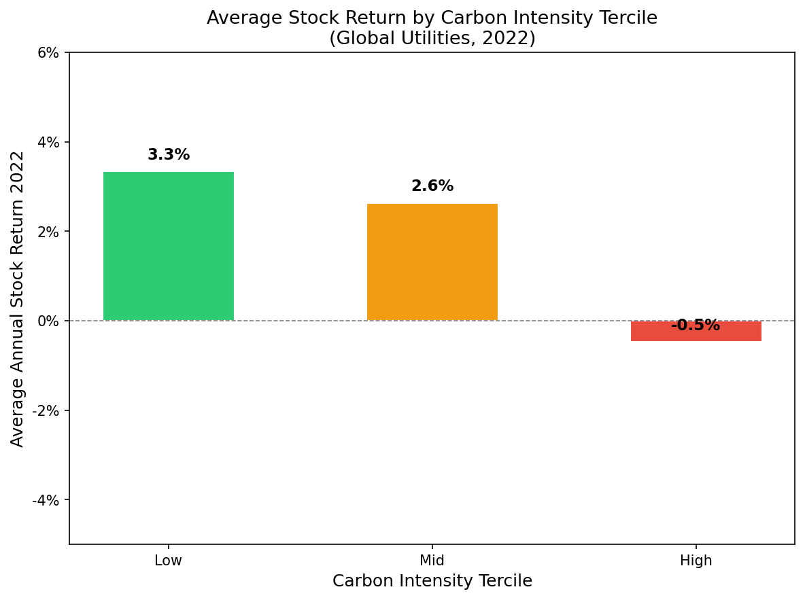
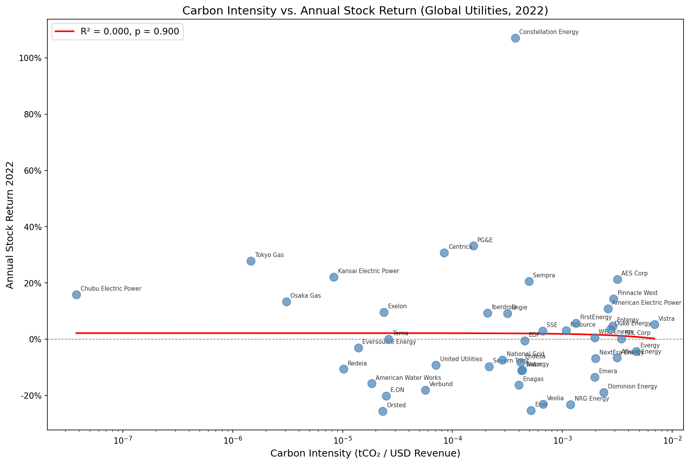
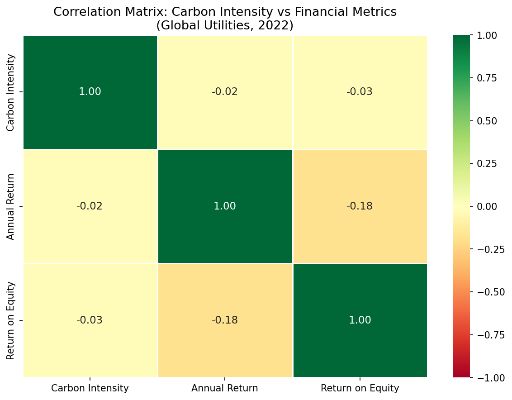

# Carbon Emissions vs. Financial Performance: A Utilities Sector Analysis

## Research Question
Is there a statistically significant association between carbon intensity and financial performance among listed utility companies?
 
## Data Sources
- **Sample Frame:** iShares Global Utilities ETF (JXI), as of April 2026
- **Emissions Data:** Scope 1 GHG emissions sourced from NZDPU (nzdpu.com), reporting year 2022
- **Financial Data:** Revenue, stock returns, ROE, and market cap sourced via yfinance, year 2022

## Sampling Methodology
The sampling frame is all utility equity constituents of the iShares Global Utilities ETF (JXI) as of April 2026, comprising 46 companies across 15 countries. Companies were excluded only where 2022 financial data was unavailable via yfinance, resulting in a final analytical sample of 45 companies.
 
**One company excluded:**
- Eletrobras (ELET3.SA) — unavailable 2022 financial data via yfinance

## Key Metric: Carbon Intensity
Carbon intensity is defined as Scope 1 GHG emissions (tCO₂e) divided by total revenue (USD). This normalises emissions for company size, enabling meaningful comparison across companies of different scales. Revenue was chosen as the denominator in line with standard ESG research practice and frameworks including TCFD.
 
## Findings
 
### 1. Tercile Analysis
Companies were split into three equal groups by carbon intensity. Average 2022 stock returns and ROE by group:
 
| Tercile | Avg Annual Return | Avg ROE |
|---|---|---|
| Low carbon intensity | +3.3% | 10.2% |
| Mid carbon intensity | +2.6% | 12.8% |
| High carbon intensity | -0.5% | 11.9% |
 
A consistent stepdown in returns from low to high carbon intensity is observed, with the highest emitting group being the only cohort to deliver negative average returns in 2022.
 

 
### 2. Correlation Analysis
Pearson correlations between carbon intensity and all financial metrics:
 
| Metric | Pearson r | p-value | Interpretation |
|---|---|---|---|
| Annual Stock Return | -0.019 | 0.900 | No meaningful relationship |
| Return on Equity | -0.029 | 0.848 | No meaningful relationship |
| Market Cap | -0.235 | 0.119 | Moderate negative association |
 
None of the correlations reach statistical significance (p < 0.05), confirming no meaningful linear relationship between carbon intensity and either annual stock returns or profitability in 2022. The analysis is therefore exploratory and directional in nature.
 

 
### 3. Correlation Heatmap
The heatmap below visualises Pearson correlations across all four variables. Carbon intensity shows near-zero correlations with annual return and ROE, and its strongest association is with market cap (-0.24). 
 

 
## Interpretation
The tercile analysis revealed a pattern in the annual return but not on the ROE. The Pearson correlation confirms no statistically significant linear relationship exists across the full sample. This could suggest that ESG signal in utility stock returns may be non-linear. However, further data and analysis is needed.
 
2022 was an unusual year for energy markets due to the Russia-Ukraine conflict, which drove energy price spikes that may have disproportionately benefited higher-emitting fossil fuel utilities and prices would have varied based on geographical factors. 

## Limitations
- **Correlation only** — causation cannot be inferred due to confounding variables including regulatory environment, geography, and energy policy
- **Single year** — 2022 was an atypical year for energy markets; findings may not apply across multiple time periods
- **Self-reported emissions** — data sourced from NZDPU is company reported and has not been independently verified
- **Sample scope** — limited to JXI constituents; may not represent the full global utilities universe

## Project Structure
- `data_collection.py` — fetches 2022 financial data from yfinance for all JXI utility constituents
- `data_preparation.py` — cleans and merges datasets, calculates carbon intensity
- `analysis.py` — Pearson correlation, tercile analysis
- `visualisation.py` — generates all charts

## Requirements
See `requirements.txt` for full dependency list. Key libraries: pandas, yfinance, matplotlib, seaborn, scipy.